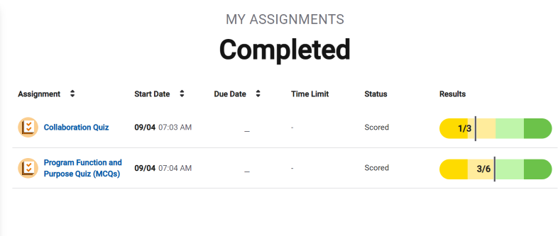

## Computing Innovation
- Applications
 - Games
 - Social Media
 - Business
 - Productivity
- Physical Devices
 - Computers
 - Smart Phones/tablets
 - Smart "Things"
 - Wearables
- Systems
 - E-commerce
 - Cloud services
 - E-mail
## Purpose of computing innovation
- Social Media Application
    - Allow users to connect from a distance and archive their activities.
- E-commerce
    - Allow users to save time and money by being able to shop from home.
- Digital Assistant Device
    - Allow users to control their devices hands-free, making them safer while driving or more convenient when trying to multitask

## Different forms of Computer programs
- tactile
- audio
- visual
- text(including numerical values)

## types of input and output do your devices accept
- Smart Phone/tablet
- Laptop computer
- Gaming Console

Most programs are written in an event driven environment
 - "Events" are triggered by some action, which usually sends input to the program

## types of event can use a trigger
+ mouse clicks
+ screen taps/swipes(force touch)
+ physical button clicks
+ keyboard entries
+ audio trigger(key word or phrase)

## output produced by a device
- visual
- audio
- tactile(touch/feel)
- text

## How does program know what to do upon an event?
### An action triggers an event
- Action may be initiated by the user or another program/device

### The program "jump" to the coe segment according to the event
- The code segment is executed
- Output is triggered by the code segment (or additional events are triggered).

### The program code is not necessarily executed "in order"

## What is a program?
### A program is a collection of statements
- A statement is a single command
- A group of statements is called a code segment
- Code segments are executed according to the rules of the programming language
- A program is often referred to as software

## What does this program do
### This code segment is written to find the minimum value in a list
- This code segment would need to work for a variety of different lists, like list that include:
    * number out of order
    * negative numbers
    * large numbers
    * decimals
- This code segment could be inserted into a larger program.

## Description
- Simply state what would it does
    * so that someone could use the code segment in a larger program
- Or include how it does what it does
    * by explaining in detail how the code segment function
    * so that someone could expand upon the code segment