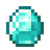

<!--
#################################################
### THIS FILE WAS AUTOGENERATED! DO NOT EDIT! ###
#################################################
# file to edit: _notebooks/2022-09-26-javatable.ipynb
-->

        

&lt;!DOCTYPE html&gt;

<html>
    <head>
        
    </head>
    <body>
        <h1>Minecraft Resources<h1>
        <table>
            <tr>
                <th>Resources</th>
                <th>Description</th>
                <th> Images</th>
            </tr>
            <tr>
                <td style = "color:skyblue;">Diamond</td>
                <td style="font-size: 50%;">A rare mineral obtained from diamond ore or loot chests</td>
                <td align=center></td>
            </tr>
            <tr>
                <td style = "color:gold;">Gold</td>
                <td style="font-size: 50%;">A material found in both the overworld and the Nether</td>
                <td align=center></td>
            </tr>
            <tr>
                <td style = "color:silver;">Iron</td>
                <td style = "font-size: 50%;">The product of the naturally occuring Silver Ore that is located underground</td>
                <td align=center></td>
            </tr>
            <tr>
                <td style = "color:green;">Emerald</td>
                <td style = "font-size: 50%;">Rare minerals that are used primarily as the currency for trading with villagers and wandering traders</td>
                <td align=center></td>
            </tr>
            <tr>
                <td style = "color:brown">Netherite</td>
                <td style = "font-size: 50%;">A material from the Nether, used primarily to upgrade diamond gear</td>
                <td align=center></td>
            </tr>
        </table>
    </body>
</html>

 

