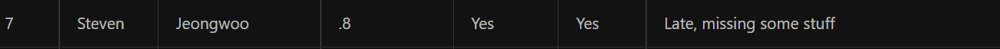
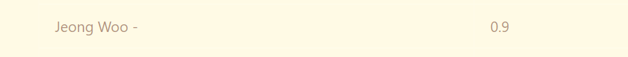
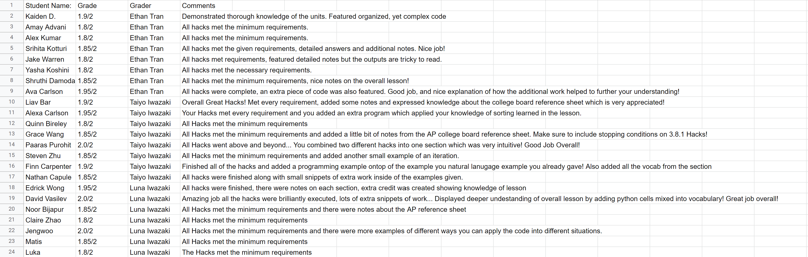
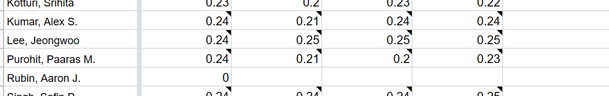
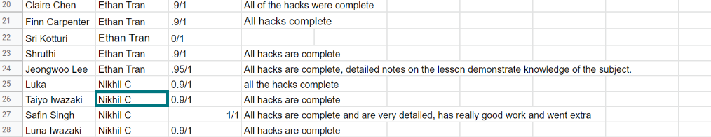

|Section|grades|Lesson|comments|hacks|
|3.1 ~ 3.2|0.8/1.0|[Lesson](https://liavb2.github.io/ominicient-lavebear/student%20lessons/2022/11/26/GroupLesson.html)|I didn't know the date to submit , so I got late.|[3.1-3.2](https://jw95z.github.io/JeongWooLee/hacks_from_other_lesson/2022/11/28/31note.html)|
|3.3 ~ 3.4|0.9/1.0|[Lesson](https://hsinaditam.github.io/Tea_Lounge/wk2/2022/11/20/Lesson-presentation.html)|I just only do what I supposed to do. I didn't add details|[3.3-3.4](https://jw95z.github.io/JeongWooLee/hacks_from_other_lesson/2022/11/29/32note.html)|
|3.8 and 3.10|2.0/2.0|[Lesson](https://teamorborb.github.io/TeamOrbOrb/lesson%20plans/2022/11/28/Unit_3.8_3.10.html)|I do my hacks creatively so that I can get a perfect score|[3.8and3.10](https://jw95z.github.io/JeongWooLee/hacks_from_other_lesson/2022/12/05/38and39.html)|
|3.9 and 3.11|0.95/1.0|[Lesson](https://gwang1224.github.io/repository_1/trimester%202%20student%20teaching/2022/12/02/unit3-9-11.html)|My hacks were perfect, but the clear button on calculator did not work. Later, I knew that I didn't put my function in clear button|[3.9and3.11](https://jw95z.github.io/JeongWooLee/hacks_from_other_lesson/2022/12/06/9and11.html)|
|3.12 ~ 3.13|0.99/1.0|[Lesson](https://davidvasilev1.github.io/group-tri2/2022/12/04/lesson3.12_3.13.html)|I did all of my hacks, but I forgot that there is an extra thing and I did not do that. Therefore, I lost 0.01 points|[3.12-3.13](https://jw95z.github.io/JeongWooLee/hacks_from_other_lesson/2022/12/08/12and13.html)|
|3.14 ~ 3.15|0.95/1.0|[Lesson](https://saavangade.github.io/Saavan/ap%20csp/unit%203/section%2014/section%2015/lesson/2022/12/11/Lesson-Unit-3-Section-14-15.html)|I completed my all hacks, but I have to put detailed notes|[3.14-3.15](https://jw95z.github.io/JeongWooLee/hacks_from_other_lesson/2022/12/12/14and15.html)|
|3.16|1.0/1.0|[Lesson](https://srihitakott1213.github.io/TeamBaddies/studentlesson/simulations)|I completed my all hacks.|[3.16](https://jw95z.github.io/JeongWooLee/hacks_from_other_lesson/2022/12/13/16.html)|
|3.17~3.18|?/1.0|[Lesson](https://srihitakott1213.github.io/TeamBaddies/studentlesson/simulations)|I completed my all hacks.|[3.16](https://jw95z.github.io/JeongWooLee/hacks_from_other_lesson/2022/12/13/16.html)|

## Proof of 3.1 ~ 3.2
[grade](https://liavb2.github.io/ominicient-lavebear/student%20lessons/2022/12/01/LessonGrading.html)

## Proof of 3.3 ~ 3.4
[grade](https://hsinaditam.github.io/Tea_Lounge/2022/12/05/Grading-Class.html)

## Proof of 3.8 and 3.10
[grade](https://teamorborb.github.io/TeamOrbOrb/grades/hacks/2022/12/06/Hacks-Grades.html)

## Proof of 3.9 and 3.11
[grade](https://docs.google.com/spreadsheets/d/1kEYHe8MNYwDukxreoWLVH0lTBwTB0MAO1LzpItTdNRM/edit#gid=0)

## Proof of 3.12 ~ 3.13
[grade](https://davidvasilev1.github.io/group-tri2/2022/12/06/grades.html)

## Proof of 3.14 ~ 3.15
[grade](https://realethantran.github.io/fastpages_EthanT/unit%203/sections%2014-15/grades/2022/12/15/Unit-3-Sections-14-15-Hacks-Grades.html)
