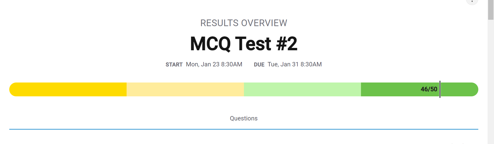
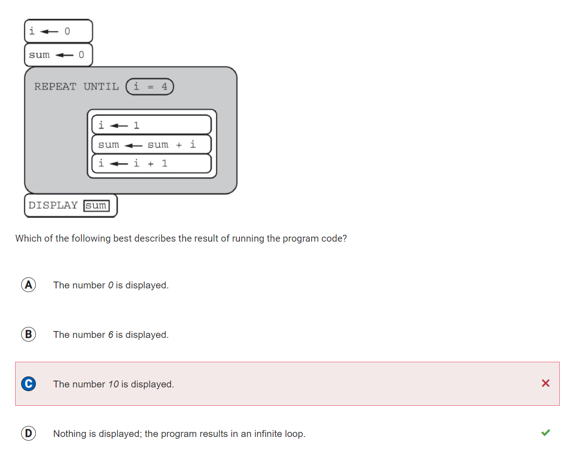
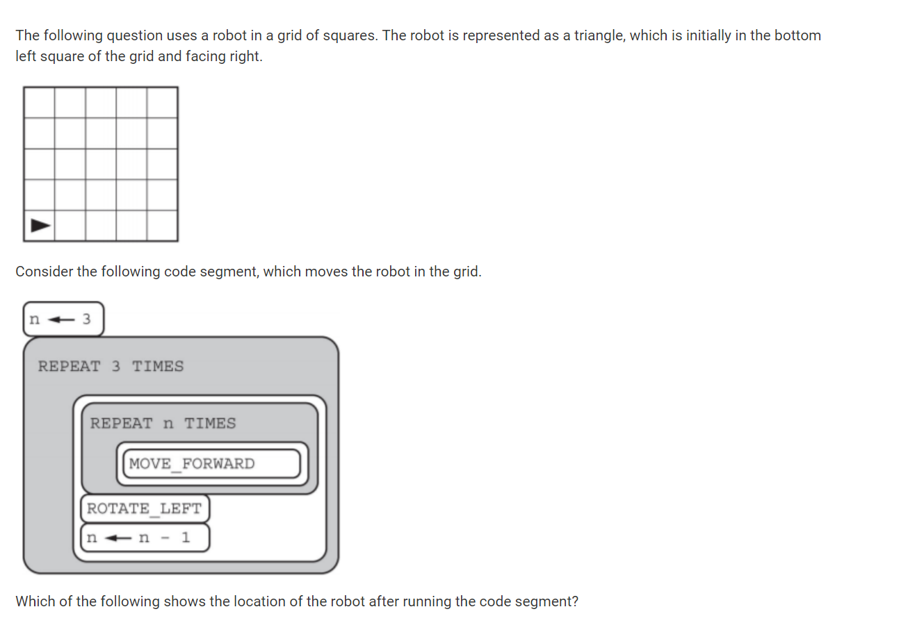
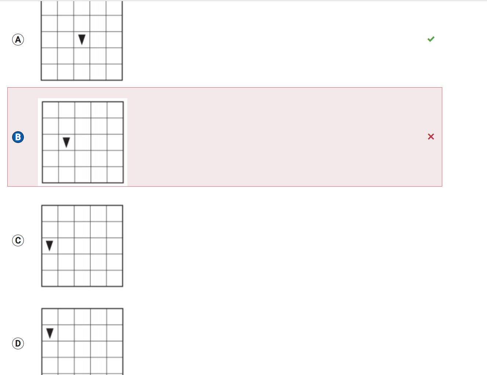
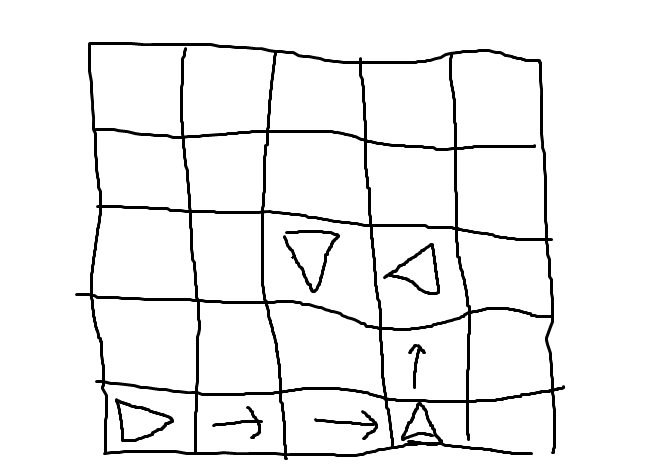
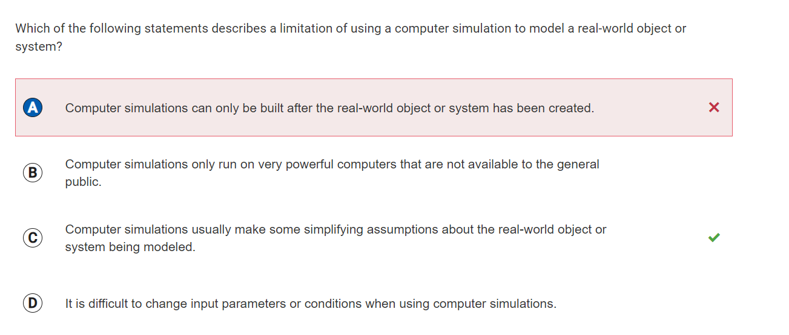
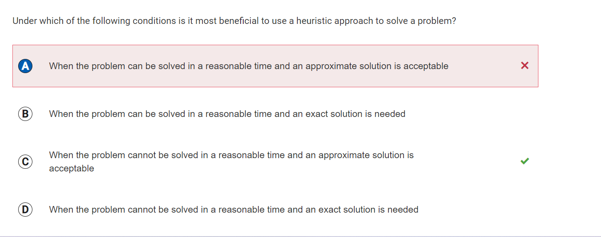

## Test correction
### Question 21

I was idiot because I miss the i = 1 in the behind of iteration. The function will repeat forever due to i. I will be always 1 so it will not reach to the end of repetition. Sum will not displayed because following code is not ended. 

### Question 29

First, the triangle will move forward 3 times so it will be forth square, turn it to right and n will be 2. Second, n is 2 so the repetition will work for 2 times and it will go two block up. The block will turn into left side and n will be 1 by abstracting 1 from 2. Last, the triangle will emigrate into middle block because n is one and moving forward only works for one time. The triangle has to be turn left because the function is still not ended. Finally, n is equal to 0 so there is no more iteration.

### Question 43

A: Simulations are mostly used for the unknown things or situation. They will run the simulation to verify whether it is safe or not. After simulation is success, people build the object or system which is identify by the simulation.
B. There are lots of simulation in this world. Some has to be really accurate and precise, but some can be simple. Therefore, not all simulation has to be ran by powerful computer. Some of then can be run by my computers too.
D. Changing input parameter is not difficult. You just have write the other input parameter in the code.     

- True answer C. Simulation is very useful for objects or systems that are still under development.

### Question 45

In this case, I don't know the word heuristic. Now I know the what does the heuristic mean. And heuristic approach is useful when the problem is not solved and not proper situation is given. 

## Reflection
I made a lot of mistakes because I took this test at 3 am. Looking at the results of this test now, I think I was a little crazy at the time. The reason I saw it at dawn was until January 31st, but I saw it as January 24th, so I had no choice but to do it quickly. If you saw it in normal conditions, you might have gotten a good test score. And it seems difficult for me to ask about definition in particular. There are two problems that I misinterpreted and got wrong.