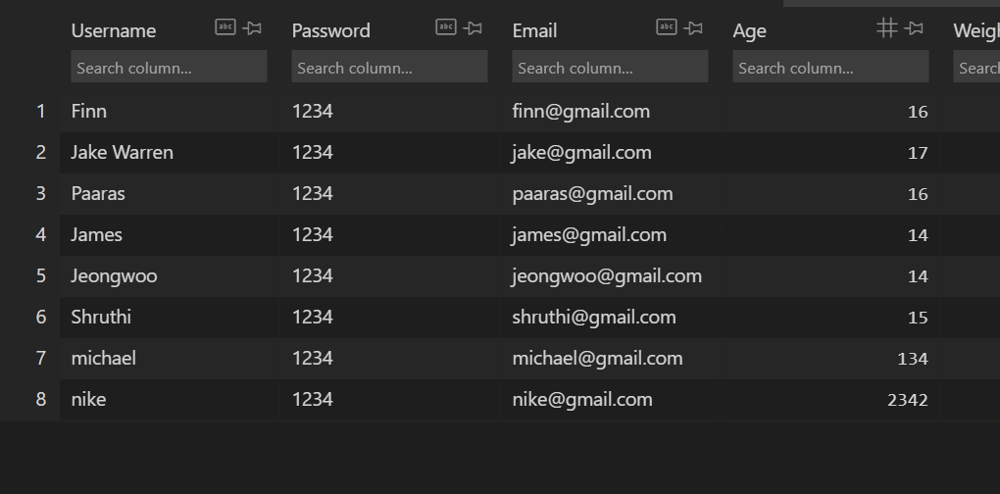
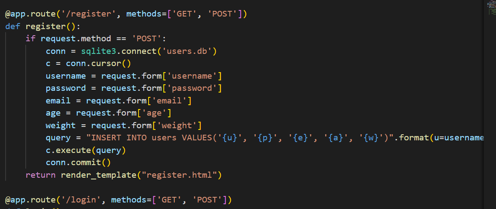

|Reporting Category|Scoring Criteria|Comments|Student Score|College Board Score|
|Program Purpose and Function|<input type="checkbox" disabled checked />Input    <input type="checkbox" disabled checked />Program Functionality    <input type="checkbox" disabled checked />Output   <input type="checkbox" disabled checked /> Main goal in the program   <input type="checkbox" disabled checked /> Functionality demonstrated in video   <input type="checkbox" disabled checked /> Input and output shown in the video|Input will be the Id, password, and other information to put in the database. Other input is related to login. We have to verify that it's right Id and password. Program functionality is to save the data in the proper database. Main goal of my program is to make login and register function|1/1|1/1|
|Data Abstraction|<input type="checkbox" disabled checked />Two code segments    <space><space> - one that shows how data has been stored in this list (or other collection type) <space>  - one that shows the data in this same list being used as part of fulfilling the program’s purpose   <input type="checkbox" disabled checked />Name of the variables representing the list being used in response   <input type="checkbox" disabled checked />what the data contained in this list is representing in the program  |The variables is username, password, age, weigh, and name. Users put the value in the variables and it will be in the database. The values will be saved as lists to make sure to pick up when it's necessary.|1/1|1/1|
|Managing Complexity|<input type="checkbox" disabled checked/>a program code segment that shows a list being used to manage complexity in the program  <input type="checkbox" disabled />How list manages complexity by explaining why the list have to written or what code will change without lists   |There is a code that shows the list and pull values from it|1/1|1/1|
|Procedural Abstraction|<input type="checkbox" disabled checked /> Two program code segment   - One provident that shows at least one effect parameter in the procedure   - one showing about calling of student's procedure|There is a parameter in the function so that it will send the value in the direct order.|1/1|1/1|
|Algorithm Implementation|<input type="checkbox" disabled checked/> Sequencing   <input type="checkbox" disabled checked /> Selection     <input type="checkbox" disabled /> Iteration   <input type="checkbox" disabled/> Describes what identified procedure is and how it contributes to overall functionality|It has sequencing, iteration, and selection. Selection is for matching ID and password, and iteration is for pulling all the values in database to match it. I will write sentences that explains how the code works.|1/1|1/1|
|Testing|<input type="checkbox" disabled /> Describes two calls that pass different argument and cause different result   <input type="checkbox" disabled checked /> Conditions tested by each call   <input type="checkbox" disabled checked /> result of each call  |I will test it when all the code is written. two call is for login and register. Besides, they also have a different result for it. One is for saving data and other is for verifying Id and password|1/1|1/1|

## Feature

My feature is login and registration. Members who have registered on our site can log in from the login page and enter their account, and those who have not registered on the site will be able to register on the site and create their own new account.

## Code plan
The functions I am doing are login and membership registration. Once the user enters information with Python or JavaScript, it is uploaded to the database, and if the ID and password match the database, it exits the login page and returns to the original page. Also, if you already have an ID when signing up for membership, a duplicate ID will not be created, and if the ID and password do not match when you log in, a warning will be issued if the login fails.

## Video plan
In my video, I'll show you how the site saves the input values ​​to the database and navigates to another page when the login is successful. If there is login information, the input will fail, and if the login is not a value in the database, the login will fail.