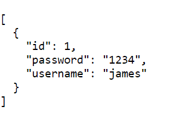
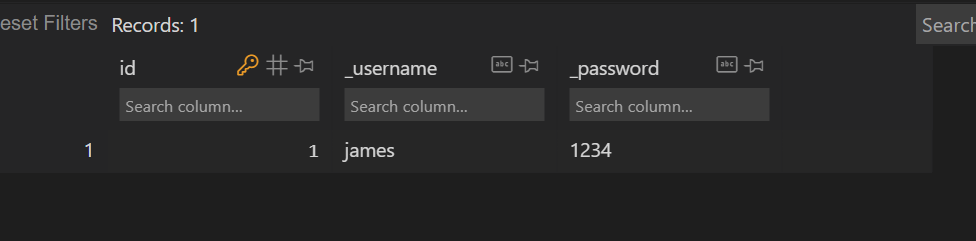
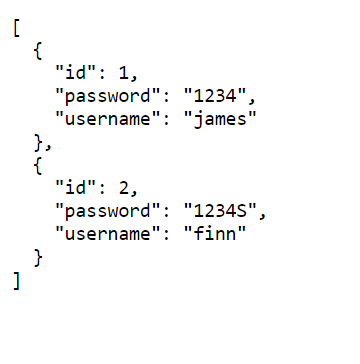
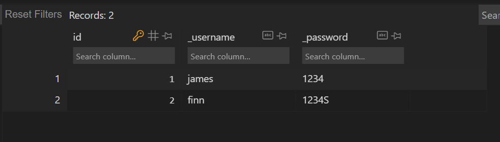
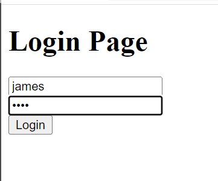
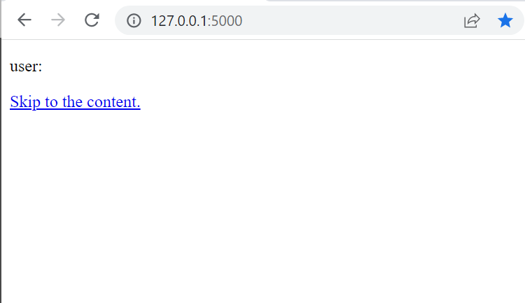
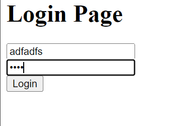
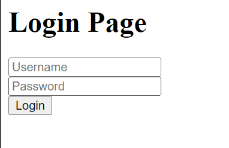

## Overview
My feature in this project is register and login. In this week, I create database and api so that I can interact with Frontend developer. Beside, I made login system. When the user tries to access our site. If the username and password which the user writes is match to any values in database, it will be success to go to our site.

## Functionality
I cannot commit my change yet, so I will show my functionality with my picture.
### Register
- First, this is my api.

- Second, this is my database table made by sqlite

- If I enter username and password, 

- username and password will go to the api

- Moreover, there is more data in the database.

### Login
- First go to login page and enter proper username and password, it will be...

- It will go to main page

- Second, if I enter wrong, it will be...

- I have to login again

