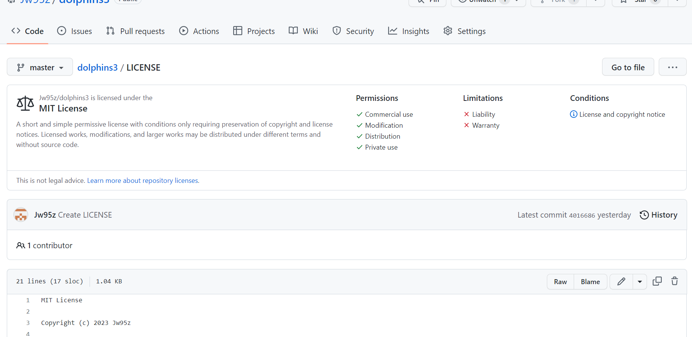

## Describe PII you have seen on project in CompSci Principles
The most common PII is github login. We have to enter personal email, username, and password for sign in. 
## What are your feelings about PII and your personal exposure?
I'm so afraid of them A long time ago, there was a person in my family whose identity was exposed, but luckily, he didn't lose that much money. However, thinking that I will suffer from it later makes me so afraid and I think I need to be careful.
## Describe good and bad passwords? What is another step that is used to assist in authentication
A good password is that related their own personal such as face or handprints. There are some lock that uses people face or identity for verification. Password can be hacked from the hacker and sometimes we can infer it. However, it is hard to copy people's trait.

## Try to describe Symmetric and Asymmetric encryption
- Symmetric encryption is a type of encryption where only one key (a secret key) is used to both encrypt and decrypt electronic information.
- Asymmetric cryptography, also known as public-key cryptography, is a process that uses a pair of related keys – one public key and one private key – to encrypt and decrypt a message and protect it from unauthorized access or use.

## Provide an example of encryption we used in AWS deployment
Encryption we used in AWS deployment - Asymmetric encryption We had to generate the public and secret keys and then add them to our repositories.

## Describe a phishing scheme you have learned about the hard way. Describe some other phishing techniques
My grandma got phishing in Korea. She got a phone call to post money into bank account because there is a car accident with her son. She was so shocked that she put her money as fast as possible. However, it was phishing. My grandma lost 1000 dollars at the phishing.

## License Types
- Creative Commons Zero: waives copyright interest in a work created and it is dedicated to the world-wide public domain
- Open Source MIT License: the author of software with MIT license wants credit
- Open Source GPL License: the license lets people do whatever they want with their project, except distributing closed-source versions

## License that I pick

## Reason 
Because I like MIT :)

