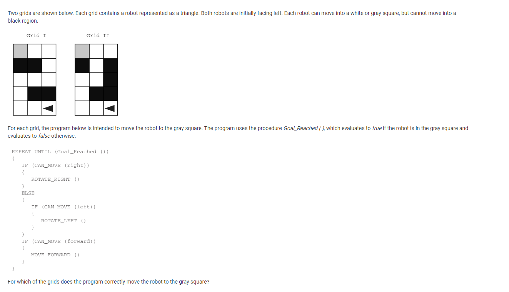
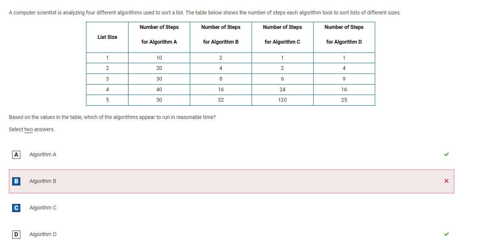
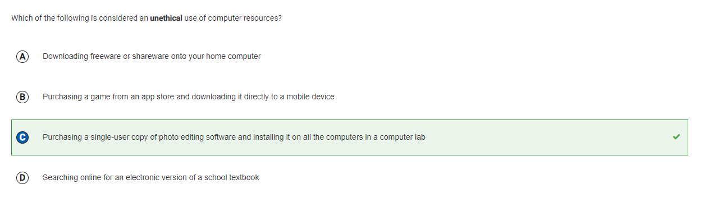
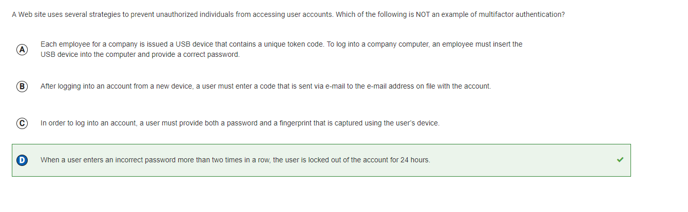

## Question 22

### My answer
D, Neither grid I nor grid II
### Correct answer
A, Grid I only
### Reason
No, I think I also picked grid 1, but when I looked at it, it turned out that I had picked D. Maybe I was too sleepy at this point and clicked the wrong button. (college board reason =  In Grid I, the robot moves forward to the end of the bottom row, turns right twice, moves forward twice, turns right twice, moves forward until the end of the middle row, turns left twice, moves forward twice, turns left twice, and moves forward until Goal_Reached is true.)

## Question 50

### My answer
Algorithm B, Algorithm C
### Correct answer
Algorithm A, Algorithm D
### Reason
As the size of the list get bigger, the number of step will grow exponentially. Therefore, Algorithm A increase with two times bigger and in term of Algorithm D, it changes with n x n. They grow exponentially, but B and C do not. (College board reason =  As the size of the list grows, the number of steps needed to sort the list grows at an exponential rate, as the number of steps is equal to 2n for a list of size n. This indicates that the algorithm does not run in a reasonable amount of time.)

## Question 14

### Correct answer
C, Purchasing a single-user copy of photo editing software and installing it on all the computers in a computer lab
### Confusion
I was confused about this question because I didn't know what unethical means. At first, I inferred that it means dangerous to users. Therefore, I pick A in the fist test, but later my friends taught me the answer is C. I thought it would be dangerous when people download any freeware in the internet. Some programmers put computer virus in the files. However, actually, unethical means not morally correct. Therefore, downloading freeware can be fine

## Question 9

### Correct answer
D, When a user enters an incorrect password more than two times in a row, the user is locked out of the account for 24 hours.
### Confusion
At first, I don't know the meaning of multifactor authentication, so I had to search what it is. Multifactor authentication is an authentication method that requires a user to provide at least two factors of confirmation in order to be granted access to an application or resource. Preventing user action if the password is incorrect is not a way to verify the user, but rather to protect the user's account. I didn't know about multifactor authentication, so I was very confused when I first saw this problem, but I think I was able to solve it after knowing the concept.