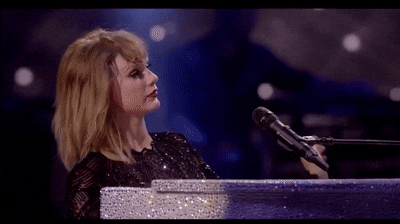

## Taylor swift's best song
Personally, I think Taylor Swift's RED album was her heyday. Before that, of course, there were a lot of good songs, but it seems that Red has become a iconic album. This by far, a masterpiece that will remain as one of the best ever. Even if you don't know Taylor, I recommend you to listen to this song. Aldo, this song is better in live video than on record. I think it's because Taylor's emotions are more buried. In a Vogue 73 interview, Taylor said that this was the song that took the longest to write. As much as he said it took a long time because he was so emotional, I can clearly feel Taylor's emotions when he sings.       

[All Too Well](https://www.youtube.com/watch?v=SINyH4I7Wcg)
