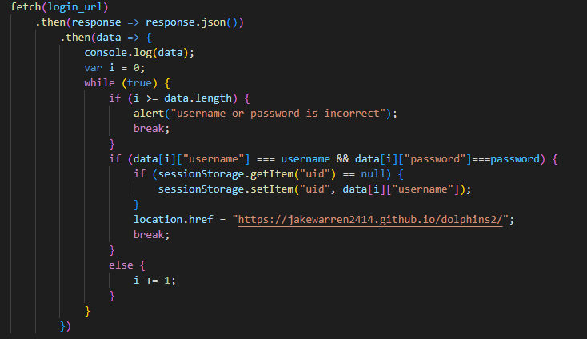
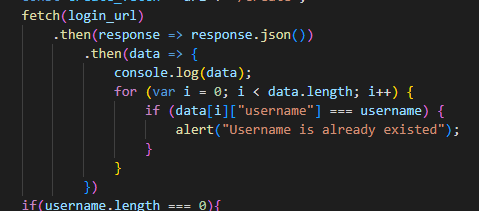
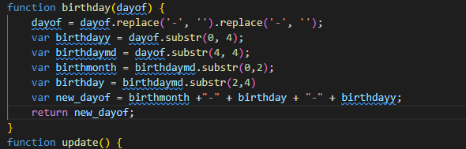
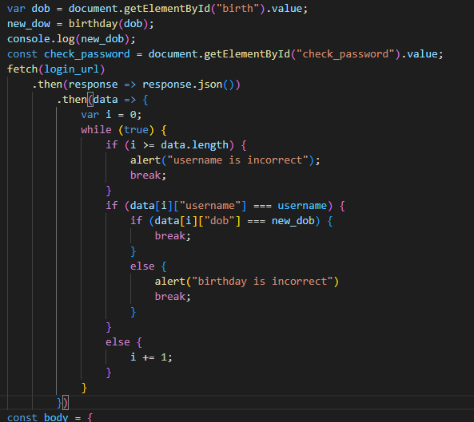

## 3.a
### 3.a.1
The program is coded so that the user can create an account on the site and log in. In addition, we made it possible for users to delete their accounts so that they can retrieve their passwords if they are lost.
### 3.a.2
In the video, it shows user inputting new username and password to make a new account. When you log in, enter the correct username and password, and go to the main page. If incorrect, the login page tells you that the username or password is incorrect.
### 3.a.3
The video will show user inputting own username, password, and birthday for making account. If account is finally created, the user will go to login page for the login. The video will show that if user enters correct username and password, he will go to main website. If there is an error during login, the warning will come out. Besides, in order to change password, user has to input the right birthday and username. 
## 3.b
### 3.b.1

### 3.b.2

### 3.b.3
data
### 3.b.4
This variable data is made into a database for users. Extract the data from the API and store it in the code as a variable called data. In this data, user names and passwords of various people and various information are grouped and divided for each user.
### 3.b.5

### 3.c.1

### 3.c.2

## Video Link
[Link]()
## Code for login
[Link](https://github.com/JakeWarren2414/dolphins2/blob/gh-pages/assets/js/login.js)
## Code for Deleting account
[Link](https://github.com/JakeWarren2414/dolphins2/blob/gh-pages/assets/js/delete.js)
## Code for changing password
[Link](https://github.com/JakeWarren2414/dolphins2/blob/gh-pages/assets/js/forgotpassword.js)